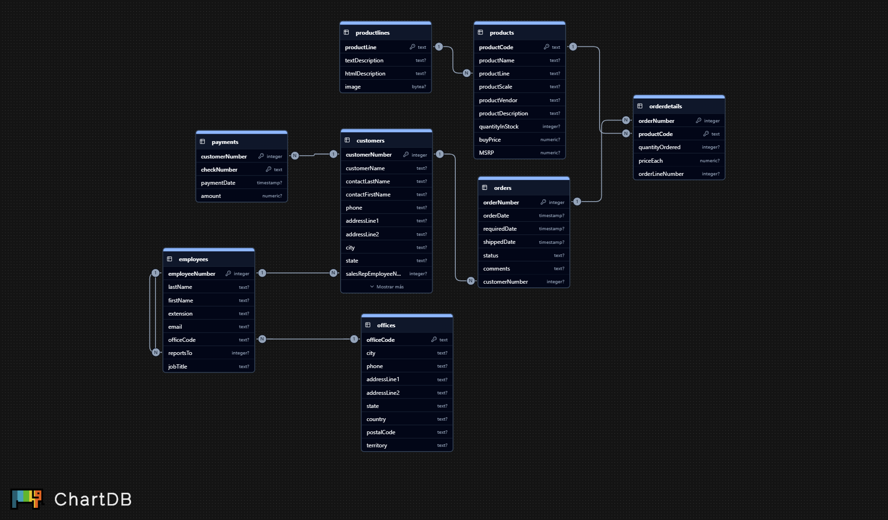

# SQL Queries: From Fundamental to Advanced

### Project Background

This project focuses on building a business intelligence dashboard to provide a comprehensive overview of the *Toys & Models* company operations.  
The main objective is to identify trends, opportunities, and operational bottlenecks through structured SQL analysis and data visualization.

The database contains detailed information about employees, products, orders, customers, and payments — forming a realistic business ecosystem suitable for relational data modeling and advanced SQL querying.

**Database Schema:**

---

### Project Summary

The goal of this project is to extract, analyze, and visualize key business insights by progressing from fundamental SQL operations to advanced analytical queries and interactive dashboards.

Each stage of the workflow builds upon the previous one:

1. **Database Connection**  
   A modular, Object-Oriented (OOP) connection layer is implemented to support multiple database engines (e.g., MySQL, PostgreSQL, SQLite).  
   This abstraction enables flexible and reusable interaction with diverse data sources.  
   > The class definitions and credential configuration can be reviewed in the repository’s `connection` module.

2. **Exploration Schema (Fundamental Queries)**  
   Initial data inspection, column validation, and integrity checks.  
   Includes descriptive statistics and detection of missing or inconsistent entries.

3. **Relational Analysis (JOINs and Aggregations)**  
   Combines multiple tables to explore business relationships between orders, customers, employees, and payments.  
   Focuses on group-level aggregations and cross-table dependencies.

4. **Strategic Analysis (Subqueries and Window Functions)**  
   Uses subqueries, CTEs, and window functions to identify trends, compute KPIs, and measure business performance.  
   These insights enable actionable recommendations for operations and sales.

5. **Consolidation and Visualization (Dashboard)**  
   Final results are presented through an interactive Vizro/Plotly dashboard, highlighting KPIs such as sales volume, order status, payment coverage, and employee performance.

---

**Summary**
- Combines SQL fundamentals with real-world business analysis.  
- Demonstrates OOP integration for scalable database access.  
- Produces a functional, executive-level dashboard for decision-making.  
- Structured to scale from academic learning to enterprise application.  

---

## Project Breakdown

This project is divided into four analytical phases, each building upon the previous one.  
The progression moves from fundamental SQL exploration to advanced analytics and visualization, demonstrating both technical depth and business insight.

---

### Database Connection

Implements a modular, Object-Oriented (OOP) connection layer that supports multiple database engines (e.g., MySQL, PostgreSQL, SQLite).  
This design provides flexible, reusable, and scalable database interaction across different environments.

> Class definitions and credential configuration can be reviewed in the repository’s `connection` module.

---

### Phase 1: Exploration Schema (Fundamental Queries)

This initial phase focuses on understanding the structure and composition of the database.

- **Table Exploration** – Identify all available tables and their corresponding variables.  
- **Business Overview** – Quantify total numbers of customers, products, and employees to establish a baseline.  
- **Customer Financial Profile** – Analyze the average, maximum, and minimum credit limits to understand financial diversity within the customer base.

**Outcome:**  
A foundational understanding of the business dataset and its key entities.

---

### Phase 2: Relational Analysis (JOINs and Aggregations)

This phase integrates multiple tables to uncover relationships between customers, employees, and transactions.

- **Sales Performance by Country** – Determine total and relative sales volume generated by region.  
- **Customer Distribution** – Map customers to their respective sales representatives to assess workload and coverage.  
- **Order Size Analysis** – Measure the number of products per order to detect large or frequent transactions.  
- **Exploration of JOINs and Relationships** – Examine the structural links between customers, employees, and the management hierarchy.

**Outcome:**  
A relational understanding of how entities interact operationally and commercially.

---

### Phase 3: Strategic Analysis (Subqueries and Window Functions)

This phase introduces advanced SQL logic—including subqueries, CTEs, and window functions—to perform strategic evaluations and generate actionable KPIs.

- **Product Classification** – Identify top-selling “star products” driving the majority of revenue.  
- **Product Trends** – Examine monthly sales dynamics to detect seasonality and growth opportunities.  
- **Employee Performance** – Rank and classify sales representatives by revenue contribution.  
- **Detailed Product Analysis** – Conduct deep performance evaluation of a selected product using advanced aggregations.  
- **Organizational Mapping** – Visualize the company’s hierarchy to understand command and reporting lines.

**Outcome:**  
A data-driven, strategic layer that translates SQL outputs into business intelligence insights.

---

### Phase 4: Consolidation and Visualization (Dashboard)

Finally, all extracted insights are consolidated into an interactive dashboard, designed to communicate the results clearly and visually.

The queries are organized into thematic panels:

#### Sales
- Product trends and total sales by country.  

#### Finances
- Correlation between credit limits and sales volume.  

#### Logistics
- Identification of top-selling and low-stock products for inventory optimization.  

#### Human Resources
- Employee performance classification and visualization of the organizational structure.

**Outcome:**  
A full end-to-end analytical workflow — from SQL query to executive dashboard — that supports data-driven decision-making across departments.

---

## Data Science Perspective

This project reflects the mindset of a **data scientist working end-to-end** — from raw relational data to analytical storytelling.

While database engineers design and optimize the systems that store data, a data scientist’s role is to:
- **Access and integrate** data efficiently from multiple sources (SQL, APIs, or flat files),
- **Transform and analyze** it to extract patterns, correlations, and business insights,
- **Build predictive models** or decision-support tools based on those insights, and
- **Communicate results** effectively through dashboards and reports.

The use of **Object-Oriented Programming (OOP)** in this project is not to replicate the work of a database administrator but to:
- Create a **modular and reproducible framework** for connecting to diverse data engines (SQLite, PostgreSQL, Oracle),
- Allow seamless **scalability and automation** of analytical workflows,
- And demonstrate how a data scientist can design a **maintainable and professional analysis pipeline** without depending on external systems.

In essence, this repository represents a **scientific approach to applied data analytics**:  
it bridges SQL engineering, analytical reasoning, and data-driven decision-making within a single, reproducible environment.
- Connect the architecture to a PostgreSQL or cloud-based database.  
- Deploy the Vizro dashboard as a live, interactive analytics application.
